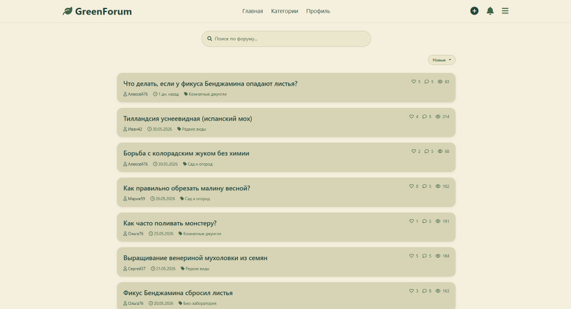
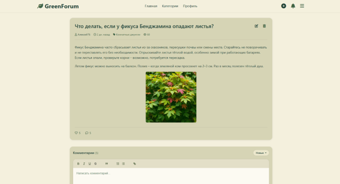
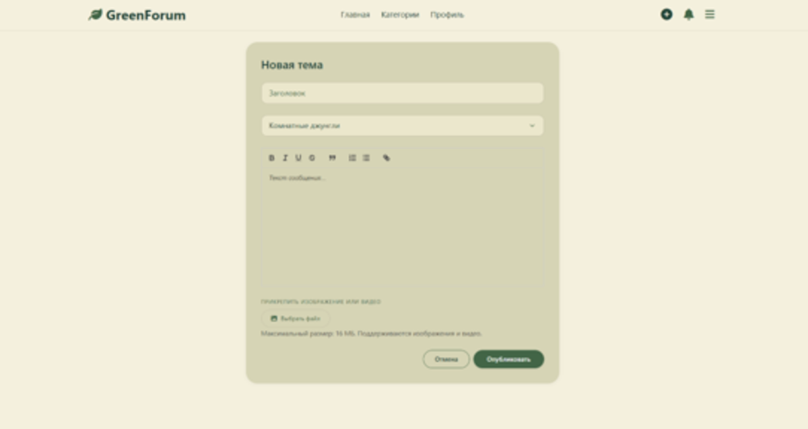
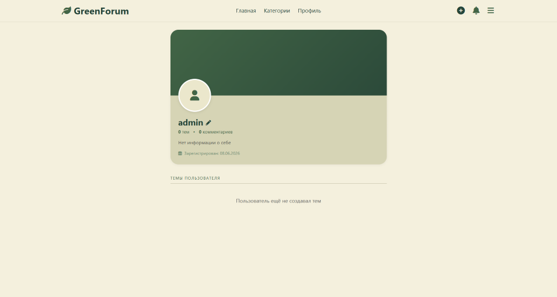
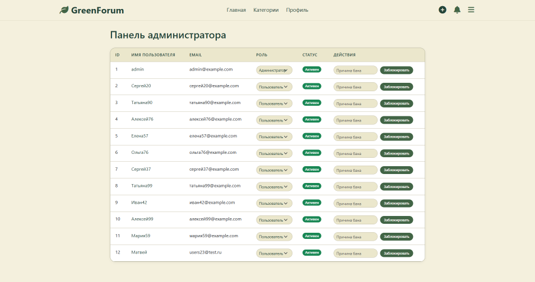

# GreenForum — Дипломный проект

**GreenForum** — это веб-форум, посвящённый экологии, растениям и устойчивому образу жизни. Проект разработан в рамках дипломной работы.

## 🚀 Функциональность

- Регистрация и авторизация пользователей (с защитой от XSS и CSRF).
- Создание, редактирование и удаление постов (тем) с поддержкой WYSIWYG-редактора (Quill).
- Комментирование постов с системой голосования (лайки/дизлайки).
- Лайки постов.
- Система уведомлений (о лайках, ответах на комментарии).
- Личный кабинет с аватаркой, баннером и настройками профиля.
- Панель администратора: управление ролями (пользователь, модератор, администратор), блокировка пользователей.
- Тёмная и светлая тема (сохраняется в профиле).
- Поиск по заголовкам и содержимому постов.
- Загрузка изображений и видео к постам.

## 🛠 Технологии

- **Backend:** Python 3, Flask, Flask-SQLAlchemy, Flask-Login, Flask-WTF
- **Frontend:** HTML5, CSS3, Bootstrap 5, JavaScript (AJAX, Fetch API), Quill.js
- **База данных:** SQLite (можно заменить на PostgreSQL)
- **Дополнительно:** python-dotenv, Werkzeug, HTMLParser

## 📦 Установка и запуск

1. Клонируйте репозиторий:
   ```bash
   git clone https://github.com/Belannandere/greenforum.git
   cd greenforum
   ```
2. Создайте виртуальное окружение и активируйте его:
   ```
   python -m venv venv
   source venv/bin/activate   # для Linux/Mac
   venv\Scripts\activate      # для Windows
   ```
3. Установите зависимости:
   ```
   pip install -r requirements.txt
   ```
4. Создайте файл .env на основе .env.example и заполните секретные ключи (укажите свой SECRET_KEY, DATABASE_URL и т.д.).
5. Запустите приложение:
   ```
   python app.py
   ```
6. Откройте в браузере: ``` http://localhost:5000 ```

---

##  Тестовый администратор
Логин: admin

Пароль: admin

Рекомендуется сменить пароль после первого входа.

## 🧪 Тестовые данные

Для быстрого заполнения базы данных демонстрационными постами и пользователями используется скрипт `seed.py`:

```bash
python seed.py
```
---

Скрипт создаст:

10 обычных пользователей (логины user_XXX, пароль password123)

25 постов с осмысленными текстами по темам растений и экологии

Комментарии к постам

Случайные лайки

Также в проекте присутствует manage_users.py – утилита для управления пользователями из командной строки (создание, баны, смена ролей).

---

## 📸 Скриншоты

<figure style="text-align: center; margin-bottom: 2rem;">
  
  <figcaption style="margin-top: 0.5rem; font-size: 0.95rem; color: #555;"><strong>Главная страница</strong> — лента постов с сортировкой и поиском</figcaption>
</figure>

<figure style="text-align: center; margin-bottom: 2rem;">
  
  <figcaption style="margin-top: 0.5rem; font-size: 0.95rem; color: #555;"><strong>Страница поста</strong> — просмотр темы, комментарии и голосование</figcaption>
</figure>

<figure style="text-align: center; margin-bottom: 2rem;">
  
  <figcaption style="margin-top: 0.5rem; font-size: 0.95rem; color: #555;"><strong>Создание поста</strong> — WYSIWYG-редактор Quill и загрузка изображений/видео</figcaption>
</figure>

<figure style="text-align: center; margin-bottom: 2rem;">
  
  <figcaption style="margin-top: 0.5rem; font-size: 0.95rem; color: #555;"><strong>Профиль пользователя</strong> — аватар, баннер, биография и список тем</figcaption>
</figure>

<figure style="text-align: center; margin-bottom: 2rem;">
  
  <figcaption style="margin-top: 0.5rem; font-size: 0.95rem; color: #555;"><strong>Панель администратора</strong> — управление ролями и блокировка пользователей</figcaption>
</figure>

---

## 🗑 Если вы всё же решите удалить
Просто удалите файлы seed.py и manage_users.py из папки и сделайте новый коммит. Но учтите: если вы уже их закоммитили ранее, они останутся в истории Git (это не страшно, но в текущей версии их не будет).

---

## 📌 Итог
Не удаляйте эти файлы, если хотите сохранить возможность быстро развернуть демо-версию форума.

Удалите, если хотите, чтобы репозиторий содержал только код самого приложения.

В любом случае, добавьте пояснение в README, если оставляете – это я и сделал.